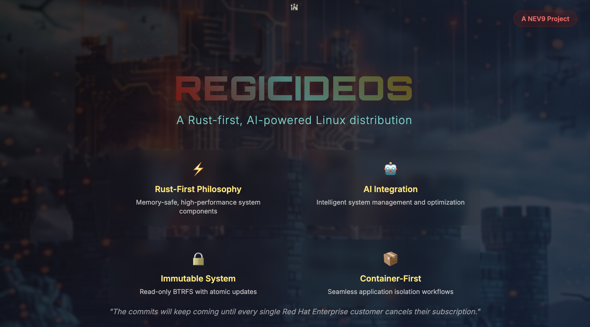

# RegicideOS Handbook

<div align="center">



**The Complete Installation and Administration Guide**

*Version 1.0 - Draft*

</div>

---

## Table of Contents

1. [Introduction](#1-introduction)
2. [System Requirements](#2-system-requirements)
3. [Installation](#3-installation)
4. [System Architecture](#4-system-architecture)
5. [Core Components](#5-core-components)
6. [AI-Powered System Management](#6-ai-powered-system-management)
    - 6.1 [PortCL - Package Management Optimization](#61-portcl---package-management-optimization)
    - 6.2 [BtrMind - Storage Management AI](#62-btrmind---storage-management-ai)
    - 6.3 [Merlin - LLM Router](#63-merlin---llm-router)
7. [Package Management](#7-package-management)
    - 7.1 [Overlay System](#71-overlay-system)
    - 7.2 [Foxmerge Package Management](#72-foxmerge-package-management)
    - 7.3 [User Configuration and Dotfiles](#73-user-configuration-and-dotfiles)
    - 7.4 [Rust Development Environment](#74-rust-development-environment)
    - 7.5 [Container-Based Applications](#75-container-based-applications)
8. [Development Environment](#8-development-environment)
9. [System Administration](#9-system-administration)
10. [Troubleshooting](#10-troubleshooting)
11. [Advanced Topics](#11-advanced-topics)

---

## 1. Introduction

### 1.1 What is RegicideOS?

RegicideOS is a revolutionary Linux distribution that represents the future of operating systems. Built as a specialized fork of Xenia Linux, RegicideOS embodies two core principles:

- **Rust-First Architecture**: Every system component that can be implemented in Rust is being migrated to Rust for maximum memory safety and performance
- **AI-Powered Operations**: Intelligent system management using continual reinforcement learning for autonomous optimization

### 1.2 Philosophy and Design Goals

RegicideOS challenges the status quo of traditional operating systems by:

- **Eliminating Memory Vulnerabilities**: Through Rust's ownership model and zero-cost abstractions
- **Autonomous System Management**: AI agents that learn and adapt to optimize system performance
- **Immutable System Architecture**: Read-only root filesystem for enhanced security and reliability
- **Future-Proof Design**: Architecture ready for next-generation technologies like the Asterinas kernel

### 1.3 Key Differentiators from Xenia Linux

| Feature | Xenia Linux | RegicideOS |
|---------|-------------|------------|
| **Desktop Environment** | Multiple choices | Cosmic Desktop only |
| **AI Integration** | Limited | Core system feature |
| **Language Focus** | Mixed ecosystem | Rust-first approach |
| **System Updates** | Traditional | Immutable/atomic |
| **Package Management** | Standard repositories | Overlay-based with AI optimization |

---

## 2. System Requirements

### 2.1 Hardware Requirements

#### Minimum Specifications
- **Processor**: 64-bit x86 CPU (Intel/AMD)
- **Memory**: 4GB RAM
- **Storage**: 12GB available disk space
- **Firmware**: UEFI or Legacy BIOS
- **Graphics**: Any GPU with basic framebuffer support

#### Recommended Specifications
- **Processor**: Multi-core x86-64 with AVX2 support
- **Memory**: 8GB+ RAM (for AI features)
- **Storage**: 20GB+ SSD storage
- **Firmware**: UEFI with Secure Boot support
- **Graphics**: GPU with Vulkan/OpenGL 4.0+ support
- **Network**: Ethernet or Wi-Fi for package updates

### 2.2 Supported Architectures

Currently supported:
- `x86_64` (AMD64)

Future planned support:
- `aarch64` (ARM64)
- `riscv64` (RISC-V)

---

## 3. Installation

### 3.1 Pre-Installation

#### 3.1.1 Live Environment Setup

RegicideOS requires installation from a Linux live environment. We recommend Fedora Live:

1. **Download Fedora Live Workstation**: https://getfedora.org/workstation/download/
2. **Create bootable USB**: Use tools like `dd`, Rufus, or balenaEtcher
3. **Boot target machine**: From the live USB environment

#### 3.1.2 Prepare Live Environment

Once booted into the live environment:

```bash
# Install dependencies (including gdisk for EFI support)
sudo dnf install -y git curl gcc gdisk

# Install Rust toolchain
curl --proto '=https' --tlsv1.2 -sSf https://sh.rustup.rs | sh
source $HOME/.cargo/env

# Clone RegicideOS repository
git clone https://github.com/awdemos/RegicideOS.git
cd RegicideOS/installer

# Prevent system suspend during installation (critical for LUKS setups)
sudo systemctl mask sleep.target suspend.target hibernate.target hybrid-sleep.target
sudo loginctl disable-lid-switch
```

> **⚠️ IMPORTANT**: Prevent system suspend during installation to avoid state corruption, especially when using LUKS encryption. The installer now handles this automatically, but manual prevention is recommended for reliability.

### 3.2 Installation Methods

#### 3.2.1 Using Pre-built Installer (Recommended)

The easiest installation method is to use the pre-built installer binary:

```bash
# Download and run the pre-built installer
sudo ./binaries/regicide-installer

# Or run with configuration file
sudo ./binaries/regicide-installer -c regicide-config.toml
```

The installer will guide you through:
1. **Drive Selection**: Choose target installation drive
2. **Filesystem Layout**: BTRFS with LUKS encryption (recommended)
3. **User Setup**: Create administrative user account
4. **Application Sets**: Choose minimal or recommended packages

#### 3.2.2 Building from Source

If you prefer to build the installer from source or need to customize it:

```bash
# Build the installer from source (now without warnings)
cargo build --release

# Verify build completed successfully
./target/release/installer --version

# Run interactive installation
sudo ./target/release/installer

# Or run with configuration file
sudo ./target/release/installer -c regicide-config.toml

# For development/testing with dry run
cargo run --bin installer -- --dry-run
```

#### 3.2.3 Automated Installation

For scripted deployments, create a configuration file:

```bash
# Create configuration
cat > regicide-config.toml << EOF
drive = "/dev/sda"
repository = "https://repo.xenialinux.com/releases/"
flavour = "cosmic-fedora"
release_branch = "main"
filesystem = "btrfs_encryption_dev"
username = "admin"
applications = "recommended"
EOF

# Run with pre-built installer (recommended)
sudo ./binaries/regicide-installer -c regicide-config.toml

# Or run with source-built installer
sudo ./target/release/installer -c regicide-config.toml
```

### 3.3 Installation Process

The RegicideOS installer performs these steps:

1. **System Preparation**
   - Prevent suspend interrupts during critical operations
   - Validate system dependencies (gdisk, cryptsetup, etc.)
   - Check network connectivity to Xenia repositories

2. **Drive Partitioning**
   - EFI System Partition (512MB, FAT32) with boot flag
   - Root Partition (8GB, ext4 for boot) + LUKS-encrypted BTRFS (remaining space)
   - Automatic retry and verification of partition creation

3. **Filesystem Setup**
   - Create BTRFS subvolumes for overlay system
   - Configure read-only root filesystem via SquashFS
   - Set up writable overlays for `/etc`, `/var`, `/usr`
   - Enhanced error handling for filesystem operations

4. **LUKS Encryption (if selected)**
   - Secure LUKS container creation with proper device path handling
   - Fixed labeling system that works with encrypted containers
   - Automatic device mapper setup and verification

5. **System Image Download**
   - Download compressed system image from Xenia repositories
   - Verify integrity and decompress to target
   - Uses `cosmic-fedora` flavor (corrected from `cosmic-desktop`)

6. **Bootloader Installation**
   - Install GRUB for EFI or Legacy BIOS
   - Automatic gdisk installation for EFI boot flags
   - Configure boot parameters for immutable system

7. **AI Component Setup**
   - Initialize AI system monitoring agents
   - Configure continual learning frameworks
   - Set up default optimization policies

8. **Post-Installation Cleanup**
   - Verify all mounts and services
   - Generate installation report

### 3.4 Manual Installation with OverlayFS ⚠️ **DEPRECATED**

> **⚠️ DEPRECATION NOTICE**: This 4-partition overlayfs layout is deprecated. RegicideOS now recommends the BTRFS-native architecture described in Section 4.1 for better performance, snapshots, and simpler management. This section is provided for reference only and should not be used for new installations.

Below is the legacy walk-through showing how the old 4-partition overlayfs system works. This should only be used for understanding existing systems or migration purposes.

Run the commands on a live ISO (or read them only for the concept—either way you will see the whole picture).

------------------------------------------------
**0. Start with empty disk (assume `/dev/sda`)**
------------------------------------------------

```
gdisk /dev/sda
```

Create four partitions and give them the **GPT partition-labels** that the Xenia initrd looks for:

| number | size       | label   | code | purpose |
|--------|------------|---------|------|---------|
| 1      | 512 MiB    | EFI     | EF00 | ESP (FAT32) |
| 2      | 5 GiB      | ROOTS   | 8300 | ext4, will hold SquashFS |
| 3      | 2 GiB      | OVERLAY | 8300 | ext4, writable layer |
| 4      | rest       | HOME    | 8300 | ext4, /home |

(You can use `fdisk -t gpt` or `parted`—only the **label string** matters.)

------------------------------------------------
**1. Make the filesystems**
------------------------------------------------

```
mkfs.vfat -n EFI     /dev/sda1
mkfs.ext4 -L ROOTS   /dev/sda2
mkfs.ext4 -L OVERLAY /dev/sda3
mkfs.ext4 -L HOME    /dev/sda4
```

------------------------------------------------
**2. Build (or download) the read-only master image**
------------------------------------------------

You need *one* directory tree that contains a complete Gentoo/rootfs.
You can:

- `emerge --root=/tmp/rootfs -N @world` on another Gentoo box, or
- extract the official Xenia root tarball into `/tmp/rootfs`.

------------------------------------------------
**3. Turn that tree into a SquashFS file**
------------------------------------------------

```
mksquashfs /tmp/rootfs  /tmp/root.img  -comp zstd -Xcompression-level 19
```

`root.img` is now the immutable "golden master".

------------------------------------------------
**4. Populate the partitions**
------------------------------------------------

Mount them anywhere convenient:

```
mkdir -p /mnt/{efi,roots,overlay,home}
mount /dev/sda1 /mnt/efi
mount /dev/sda2 /mnt/roots
mount /dev/sda3 /mnt/overlay
mount /dev/sda4 /mnt/home
```

Copy the image:

```
cp /tmp/root.img /mnt/roots/
```

Create empty overlay directories (the initrd will use them):

```
mkdir -p /mnt/overlay/upper /mnt/overlay/work
```

(You can leave `/mnt/home` empty; the first boot will create lost+found and any dot-files.)

------------------------------------------------
**5. Install GRUB so UEFI can start it**
------------------------------------------------

We still need a kernel + initrd **inside** the SquashFS so GRUB can load them.
The easiest way is to bind-mount the SquashFS once, chroot into it, build a kernel/initrd, then copy those two files back to the ESP.

```
mkdir /tmp/sq
mount -t squashfs /mnt/roots/root.img /tmp/sq
cp -a /tmp/sq/boot/{vmlinuz-*,initramfs-*} /mnt/roots/
umount /tmp/sq
```

Now install GRUB (still from the live environment):

```
grub-install --target=x86_64-efi --efi-directory=/mnt/efi --boot-directory=/mnt/roots/boot --removable
```

`--removable` makes the firmware find `\EFI\BOOT\BOOTX64.EFI` (no NVRAM entry needed).

Create a minimal `grub.cfg` (on the ESP, or in `/mnt/roots/boot/grub/grub.cfg`):

```
set root=(hd0,gpt2)        # ROOTS partition
linux  /boot/vmlinuz-<ver> root=LABEL=ROOTS overlay=LABEL=OVERLAY home=LABEL=HOME quiet
initrd /boot/initramfs-<ver>.img
```

------------------------------------------------
**6. First boot – what the initrd does**
------------------------------------------------

- Opens LUKS if you encrypted anything.
- Mounts **ROOTS** read-only → finds `root.img`.
- Mounts **OVERLAY** read-write.
- Creates the OverlayFS merge:
  ```
  mount -t overlay overlay -o lowerdir=/rootfs,upperdir=/overlay/upper,workdir=/overlay/work /newroot
  ```
- Binds **HOME** onto `/newroot/home`.
- `switch_root` → systemd starts.

You now have a **writable** system whose *base* is still the pristine SquashFS.

------------------------------------------------
**7. Daily life & upgrades**
------------------------------------------------

- Install packages, edit configs, add users – everything lands in **OVERLAY**.
- When a new OS release appears, just drop the new `root-new.img` into the ROOTS partition and reboot; GRUB picks the newest file by mtime.
- If you ever break the overlay, boot with `overlay=disabled` (GRUB menu entry) – you are instantly back to the clean SquashFS.

------------------------------------------------

That is literally all the "magic": four labelled partitions, one SquashFS, one overlay mount.
Once you see the commands above, the phrase "single system image" just means "every machine can share the same SquashFS and only keep its *local* differences in a thin writable layer."

#### 3.4.1 Architecture Benefits

1. **System Integrity**: Base system cannot be accidentally modified
2. **Easy Updates**: Just drop in a new SquashFS image
3. **Fast Rollback**: Boot without overlay to return to clean state
4. **Storage Efficiency**: Single system image shared across multiple machines
5. **Snapshot Support**: Overlay state can be snapshotted and restored
6. **Security**: Immutable root reduces attack surface

### 3.5 Post-Installation

After successful installation:

1. **Remove installation media** and reboot
2. **Complete initial setup** through Cosmic Desktop
3. **Verify system integrity**:
   ```bash
   # Check all mounts are working
   mount | grep -E "(overlay|btrfs)"
   
   # Verify AI services status
   systemctl status portcl btrmind
   
   # Check for installation errors
   sudo journalctl -u installer.service --since "5 minutes ago"
   ```
4. **Enable AI features** (optional, see Section 6)
5. **Install additional software** through overlay system
6. **Security verification** (critical due to installer vulnerabilities):
   ```bash
   # Check for suspicious processes
   ps aux | grep -E "(sh|bash)" | grep -v grep
   
   # Verify no unexpected network connections
   ss -tulpn | grep LISTEN
   
   # Review installation logs for anomalies
   sudo journalctl -u installer.service | grep -E "(ERROR|WARN|command)"
   ```

---

## 4. System Architecture

### 4.1 BTRFS-Native Architecture

RegicideOS uses BTRFS-native snapshots and sub-volumes to provide the same illusion of "one immutable image + a thin writable layer", while also giving you **copy-on-write snapshots for free**.

#### 4.1.1 Disk Layout

```
/dev/sda1   512 MB  FAT32   label "EFI"
/dev/sda2   rest    BTRFS   label "ROOTS"   ← single big BTRFS partition
```

Inside that second partition we create **five fixed sub-volumes**:

```
ROOTS (top-level BTRFS)
├─ @                ← empty, reserved for root-image *files*
├─ @overlay         ← top-level for overlays
│  ├─ @etc           ← writable layer for /etc
│  ├─ @var           ← writable layer for /var
│  └─ @usr           ← writable layer for /usr
└─ @home             ← /home tree
```

*(The installer calls them `overlay`, `etc`, `var`, `usr`, `home` without the "@" the @ is just a BTRFS convention.)*

#### 4.1.2 Boot Sequence with BTRFS

1. **UEFI → GRUB → kernel + initrd** (loaded from a **SquashFS** that lives in the *root* of ROOTS).
2. **Early user-space** (foxmount helper) does **not** use overlayfs at all; it does:
   ```
   mount -t btrfs -o subvol=@etc  /dev/sda2  /sysroot/etc
   mount -t btrfs -o subvol=@var  /dev/sda2  /sysroot/var
   mount -t btrfs -o subvol=@usr  /dev/sda2  /sysroot/usr
   mount -t btrfs -o subvol=@home /dev/sda2  /sysroot/home
   ```
   The **SquashFS** is loop-mounted **once** on `/sysroot`; the individual **BTRFS sub-volumes are bind-mounted on top** of the directories that must stay writable.
3. **Switch-root** into `/sysroot` → systemd starts.

#### 4.1.3 Why BTRFS is Better for RegicideOS

| classic overlayfs | BTRFS snapshots |
|---|---|
| upperdir + workdir must live on **same fs** as each other, but **can be different** from lowerdir → you still need two partitions (ROOTS + OVERLAY). | Everything is **one partition**; no extra partition for "OVERLAY". |
| No built-in snapshot of the **writable layer**. | Every sub-volume can be snapshotted instantly: `btrfs sub snap -r @etc @etc-2025-09-21` |
| Deleting the old lower SquashFS frees **zero** space until you delete the overlay too. | Deleting an old `root.img` **immediately** frees space (BTRFS reflinks are per-file, not per-dir). |
| Roll-back of **system** means rebooting into old SquashFS; roll-back of **user changes** means wiping the whole upperdir. | You can roll **either** direction independently: `snapper rollback @etc` to yesterday while keeping today's `/usr` layer. |
| Overlayfs white-outs sometimes confuse backup tools. | Plain directories and files—nothing exotic. |

#### 4.1.4 Snapshot Workflow

```
# take a consistent checkpoint before big changes
btrfs subvolume snapshot -r @etc @etc-before-emerge
btrfs subvolume snapshot -r @usr @usr-before-emerge

# do potentially dangerous stuff
emerge -avuDN @world

# if it breaks, roll back in seconds
btrfs subvolume delete @etc
btrfs subvolume snapshot @etc-before-emerge @etc
reboot   # now you're on yesterday's /etc with today's kernel
```

#### 4.1.5 Key Benefits

- **Still boots from a read-only SquashFS** (the "golden image").
- **Writable parts are not an overlayfs layer** any more; they are **individual BTRFS sub-volumes** that get **bind-mounted on top** of the squashfs directories.
- This gives the same "immutable base + disposable changes" behaviour, **plus** instant snapshots, roll-backs, and single-partition simplicity—reason enough for the docs to say *"Use BTRFS only; the old layouts are deprecated."*

### 4.2 BTRFS Command Reference

Here are the essential BTRFS commands for managing your RegicideOS system:

#### 4.2.1 Subvolume Management

```bash
# List all subvolumes
btrfs subvolume list /mnt/roots

# Create a new subvolume
btrfs subvolume create /mnt/roots/@new-subvol

# Delete a subvolume
btrfs subvolume delete /mnt/roots/@old-subvol

# Create a snapshot (read-only)
btrfs subvolume snapshot -r /mnt/roots/@etc /mnt/roots/@etc-2025-09-20

# Create a snapshot (writable)
btrfs subvolume snapshot /mnt/roots/@etc /mnt/roots/@etc-working

# Show subvolume information
btrfs subvolume show /mnt/roots/@etc
```

#### 4.2.2 System Maintenance

```bash
# Check filesystem status
btrfs filesystem df /mnt/roots
btrfs filesystem usage /mnt/roots

# Balance the filesystem (optimizes data distribution)
btrfs balance start /mnt/roots

# Scrub the filesystem (checks for data errors)
btrfs scrub start /mnt/roots
btrfs scrub status /mnt/roots

# Defragment files
btrfs filesystem defrag -r /mnt/roots/@usr

# Enable compression on new files
btrfs property set /mnt/roots/@var compression zstd
```

#### 4.2.3 Snapshot Management

```bash
# Create consistent system snapshot before major changes
btrfs subvolume snapshot -r /mnt/roots/@etc /mnt/roots/@etc-before-emerge
btrfs subvolume snapshot -r /mnt/roots/@usr /mnt/roots/@usr-before-emerge
btrfs subvolume snapshot -r /mnt/roots/@var /mnt/roots/@var-before-emerge

# Roll back after failed operation
btrfs subvolume delete /mnt/roots/@etc
btrfs subvolume snapshot /mnt/roots/@etc-before-emerge /mnt/roots/@etc

# Send/receive snapshots (for backup/transfer)
btrfs send /mnt/roots/@etc-2025-09-20 | btrfs receive /backup/snapshots/

# List snapshots
btrfs subvolume list -s /mnt/roots
```

#### 4.2.4 Migration from OverlayFS

```bash
# If migrating from old overlayfs layout, create subvolumes:
btrfs subvolume create /mnt/roots/@etc
btrfs subvolume create /mnt/roots/@usr
btrfs subvolume create /mnt/roots/@var
btrfs subvolume create /mnt/roots/@home

# Copy existing overlay data to new subvolumes
cp -a /mnt/overlay/etc/* /mnt/roots/@etc/
cp -a /mnt/overlay/usr/* /mnt/roots/@usr/
cp -a /mnt/overlay/var/* /mnt/roots/@var/

# Set default subvolume if needed
btrfs subvolume set-default /mnt/roots/@
```

### 4.3 Security Model

- **Read-Only Root**: Base system cannot be modified during runtime
- **Verified Boot**: System image integrity verified at boot
- **Namespace Isolation**: Containers provide application isolation
- **Memory Safety**: Rust components eliminate entire vulnerability classes

---

## 5. Core Components

### 5.1 Cosmic Desktop Environment

RegicideOS exclusively ships with Cosmic Desktop, System76's next-generation desktop environment:

#### Features:
- **Rust Implementation**: Built with Iced framework for performance
- **Wayland Native**: Modern display protocol support
- **GPU Acceleration**: Hardware-accelerated graphics pipeline
- **Tiling Window Manager**: Efficient workspace organization

#### Configuration:
```bash
# Cosmic settings are stored in
~/.config/cosmic/

# Example: Enable tiling by default
cosmic-settings set tiling.default true

# Configure display scaling
cosmic-settings set display.scale-factor 1.5
```

### 5.2 System Components

#### 5.2.1 Init System
- **systemd**: Service and process management
- **Custom Units**: AI agents run as systemd services

#### 5.2.2 Container Runtime
- **Distrobox**: Application containerization
- **Podman Backend**: Secure, rootless containers
- **Integration**: Seamless desktop application support

### 5.3 Network Management

RegicideOS uses NetworkManager with systemd integration:

```bash
# View network status
nmcli general status

# Connect to WiFi
nmcli dev wifi connect "SSID" password "password"

# Configure static IP
nmcli con add type ethernet ifname eth0 ip4 192.168.1.100/24 gw4 192.168.1.1
```

---

## 6. AI-Powered System Management

RegicideOS implements three primary AI agents for autonomous system management:

### 6.1 PortCL - Package Management Optimization

**PortCL** (Portage Continual Learning) optimizes package management operations using reinforcement learning.

#### Key Features:
- **Build Optimization**: Automatic parallelism adjustment based on system load
- **Dependency Management**: Intelligent build order optimization  
- **Resource Scheduling**: Off-peak operation scheduling for resource-intensive tasks
- **Continual Learning**: Adapts to changing system configurations

#### Configuration:
```toml
# /etc/portcl/config.toml
[monitoring]
poll_interval = 30  # seconds
metrics_history = 24  # hours

[learning]
model_path = "/var/lib/portcl/model.pt"
replay_buffer_size = 10000
learning_rate = 0.001

[actions]
enable_parallelism_adjustment = true
enable_build_reordering = true
enable_scheduling = true
```

#### Usage:
```bash
# Start PortCL service
sudo systemctl enable --now portcl.service

# View current status
portcl status

# Manual action trigger
portcl optimize --task build_optimization
```

### 6.2 BtrMind - Storage Management AI

**BtrMind** proactively manages BTRFS filesystem health using reinforcement learning.

#### Key Features:
- **Space Optimization**: Automatic cleanup of temporary files and caches
- **Compression Management**: Intelligent file compression based on access patterns
- **Metadata Balancing**: BTRFS metadata optimization
- **Snapshot Management**: Automated snapshot cleanup and rotation

#### Configuration:
```toml
# /etc/btrmind/config.toml
[thresholds]
warning_level = 85.0      # Disk usage percentage
critical_level = 95.0     # Critical threshold
emergency_level = 98.0    # Emergency cleanup

[actions]
enable_compression = true
enable_balance = true
enable_snapshot_cleanup = true
enable_temp_cleanup = true

[learning]
model_update_interval = 3600  # 1 hour
reward_smoothing = 0.95
exploration_rate = 0.1
```

#### Usage:
```bash
# Check BtrMind status
sudo systemctl status btrmind.service

# Manual space analysis
btrmind analyze

# Force cleanup action
sudo btrmind cleanup --aggressive
```

### 6.3 System Health Monitoring

#### 6.3.1 Metrics Collection
The AI agents collect comprehensive system metrics:

- **Performance**: CPU, memory, I/O utilization
- **Storage**: Disk usage, fragmentation, access patterns
- **Network**: Bandwidth utilization, connection quality
- **Applications**: Resource consumption, crash rates

#### 6.3.2 Learning and Adaptation
All agents implement continual reinforcement learning:

1. **State Observation**: Continuous system monitoring
2. **Action Selection**: AI-driven decision making
3. **Reward Calculation**: Performance improvement scoring
4. **Model Update**: Continuous learning without forgetting
5. **Knowledge Transfer**: Cross-agent information sharing

### 6.4 AI Agent Management

#### 6.4.1 Service Management
```bash
# View all AI services
sudo systemctl list-units "*mind*" "*portcl*"

# Enable AI monitoring
sudo systemctl enable portcl btrmind

# Disable AI features
sudo systemctl stop portcl btrmind
sudo systemctl disable portcl btrmind
```

#### 6.4.2 Performance Monitoring
```bash
# View agent performance logs
sudo journalctl -u portcl.service -f
sudo journalctl -u btrmind.service -f

# Check learning progress
portcl metrics --learning-progress
btrmind stats --model-performance
```

### 6.3 Merlin - LLM Router

**Merlin** is an intelligent multi-provider LLM router designed for RegicideOS that provides smart routing and load balancing across different language model providers.

#### Key Features:
- **Multi-Provider Support**: OpenAI, Anthropic, Gemini, and local GGUF models
- **Smart Routing**: Epsilon-greedy and Thompson sampling algorithms for optimal model selection
- **Real-Time Metrics**: Performance monitoring and quality judging
- **Observability**: Comprehensive telemetry and health checking
- **High Availability**: Automatic failover and load balancing

#### Configuration:
```toml
# /etc/merlin/config.toml
[server]
port = 7777
host = "127.0.0.1"

[routing]
policy = "epsilon_greedy"  # or "thompson_sampling"
exploration_rate = 0.1

[providers.openai]
api_key = "your-openai-key"
base_url = "https://api.openai.com/v1"
models = ["gpt-4", "gpt-3.5-turbo"]

[providers.anthropic]
api_key = "your-anthropic-key"
base_url = "https://api.anthropic.com"
models = ["claude-3-opus", "claude-3-sonnet"]

[providers.gemini]
api_key = "your-gemini-key"
base_url = "https://generativelanguage.googleapis.com/v1beta"
models = ["gemini-pro"]

[providers.gguf]
model_path = "/var/lib/merlin/models/"
enabled = true

[telemetry]
enable_metrics = true
metrics_port = 9090
log_level = "info"
```

#### Usage:
```bash
# Start Merlin service
sudo systemctl enable --now merlin.service

# Manual start with custom config
merlin serve --port 7777 --config /etc/merlin/config.toml

# Check service health
curl http://localhost:7777/health

# View metrics
curl http://localhost:7777/metrics

# Send chat request
curl -X POST http://localhost:7777/chat \
  -H "Content-Type: application/json" \
  -d '{"prompt": "Hello, Merlin!", "provider": "auto"}'
```

#### API Endpoints:
- `GET /health` - Service health status
- `GET /metrics` - Performance metrics and statistics
- `POST /chat` - Send chat requests (returns optimal provider response)
- `GET /providers` - List available providers and models
- `POST /feedback` - Provide quality feedback for routing improvement

#### Integration with RegicideOS:
Merlin integrates seamlessly with other RegicideOS AI components:

```bash
# Configure PortCL to use Merlin for optimization suggestions
sudo nano /etc/portcl/config.toml
[ai]
llm_router = "http://localhost:7777/chat"
model_preference = "auto"

# Configure BtrMind to use Merlin for storage analysis
sudo nano /etc/btrmind/config.toml
[ai]
llm_endpoint = "http://localhost:7777/chat"
```

---

## 7. Package Management

### 7.1 Overlay System

RegicideOS uses a hybrid package management approach combining:

1. **Base System**: Immutable system image from Xenia repositories
2. **GURU Overlay**: Community-maintained packages
3. **Regicide Overlay**: Custom modifications and AI-enhanced packages

### 7.2 Foxmerge Package Management

Foxmerge is Xenia Linux's primary package management tool, inherited by RegicideOS for managing overlay packages and system updates. It provides a simplified interface for Gentoo's Portage system while maintaining compatibility with the underlying Gentoo ecosystem.

#### 7.2.1 Basic Foxmerge Operations

**System Updates:**
```bash
# Update all overlay packages
sudo foxmerge update

# Update specific package
sudo foxmerge update package-name

# Check for available updates
sudo foxmerge check-updates

# Clean up old packages
sudo foxmerge clean
```

**Package Installation:**
```bash
# Install a package
sudo foxmerge install package-name

# Install multiple packages
sudo foxmerge install package1 package2 package3

# Install with specific USE flags
sudo foxmerge install package-name --use "flag1 flag2"

# Install from specific overlay
sudo foxmerge install package-name --overlay overlay-name
```

**Package Management:**
```bash
# Remove a package
sudo foxmerge remove package-name

# Search for packages
sudo foxmerge search search-term

# Get package information
sudo foxmerge info package-name

# List installed packages
sudo foxmerge list

# List available packages
sudo foxmerge list --available
```

#### 7.2.2 Advanced Foxmerge Usage

**Overlay Management:**
```bash
# List available overlays
sudo foxmerge overlay list

# Enable an overlay
sudo foxmerge overlay enable overlay-name

# Disable an overlay
sudo foxmerge overlay disable overlay-name

# Sync overlay repositories
sudo foxmerge overlay sync

# Add custom overlay
sudo foxmerge overlay add https://github.com/user/overlay.git
```

**Configuration Management:**
```bash
# View current configuration
sudo foxmerge config show

# Edit configuration
sudo foxmerge config edit

# Set configuration option
sudo foxmerge config set option value

# Reset configuration to defaults
sudo foxmerge config reset
```

**Dependency Resolution:**
```bash
# Resolve dependencies for a package
sudo foxmerge deps package-name

# Show reverse dependencies
sudo foxmerge deps --reverse package-name

# Check for conflicts
sudo foxmerge check-conflicts package-name

# Fix broken dependencies
sudo foxmerge fix-deps
```

#### 7.2.3 System Maintenance with Foxmerge

**Regular Maintenance:**
```bash
# Full system update and cleanup
sudo foxmerge update && sudo foxmerge clean

# Update overlays and sync repositories
sudo foxmerge overlay sync && sudo foxmerge update

# Check system health
sudo foxmerge health-check

# Optimize package database
sudo foxmerge optimize
```

**Troubleshooting:**
```bash
# Check for broken packages
sudo foxmerge check-broken

# Repair broken packages
sudo foxmerge repair

# Clear package cache
sudo foxmerge cache-clear

# Rebuild package database
sudo foxmerge rebuild-db
```

#### 7.2.4 Foxmerge Configuration

**Main Configuration File (`/etc/foxmerge.conf`):**
```bash
# Overlay repositories
overlays = ["guru", "regicide", "science"]

# Update settings
auto_sync = true
auto_clean = true
parallel_jobs = 4

# Build options
makeopts = "-j4"
use_flags = ["X", "alsa", "pulseaudio"]

# Logging
log_level = "info"
log_file = "/var/log/foxmerge.log"
```

**User Configuration (`~/.config/foxmerge/config`):**
```bash
# User-specific settings
[settings]
  default_overlay = "regicide"
  color_output = true
  verbose_output = false

[aliases]
  up = "update"
  in = "install"
  rm = "remove"
  se = "search"
```

#### 7.2.5 Integration with System Updates

Foxmerge works seamlessly with Xenia Linux's update system:

```bash
# Automated system update process
sudo xenia-update  # Updates base system image
sudo foxmerge update  # Updates overlay packages

# Combined update script
sudo system-update-full
```

This two-tier approach ensures:
- **Base System**: Updated atomically via SquashFS images
- **Overlay Packages**: Updated incrementally via foxmerge
- **AI Optimization**: PortCL optimizes package selection and updates

### 7.3 User Configuration and Dotfiles

RegicideOS provides official dotfiles for a consistent, modern development experience:

#### 7.3.1 Installing RegicideOS Dotfiles

The official dotfiles package provides a Rust-focused shell configuration with RegicideOS theming:

```bash
# Add the dotfiles overlay
sudo eselect repository enable regicide-dotfiles
sudo emaint sync -r regicide-dotfiles

# Install the dotfiles package
sudo emerge -av app-misc/regicide-dotfiles

# Install dotfiles for your user
install-regicide-dotfiles

# For specific users (system administrators)
sudo install-regicide-dotfiles --user username
```

**Features included:**
- Modern Rust CLI tools (eza, bat, fd, ripgrep, zoxide)
- Enhanced bash with intelligent aliases and functions
- RegicideOS-themed tmux configuration
- Starship prompt with castle theming
- OpenRC/systemd service management
- BTRFS optimization tools
- Portage helper functions

#### 7.3.2 Dotfiles Customization

After installation, you can customize your environment:

```bash
# Edit shell configuration
nano ~/.bashrc

# Customize tmux
nano ~/.tmux.conf

# Configure prompt
nano ~/.config/starship.toml

# Set up Git configuration
nano ~/.gitconfig
```

**Backup and Restore:**
```bash
# Uninstall dotfiles (creates backup)
uninstall-regicide-dotfiles

# Restore from backup
uninstall-regicide-dotfiles --restore-backup
```

#### 7.3.3 System-wide Configuration

For system administrators deploying dotfiles to multiple users:

```bash
# Install to skeleton directory for new users
sudo install-regicide-dotfiles --system-only

# New users will automatically get dotfiles
sudo useradd -m newuser
```

**Portage Configuration Template:**
```bash
# Copy system optimization template
sudo cp /usr/share/regicide-dotfiles/contrib/make.conf.template /etc/portage/make.conf

# Edit for your hardware
sudo nano /etc/portage/make.conf
```

### 7.4 Rust Development Environment

#### 7.4.1 Rust Toolchain Management

RegicideOS provides comprehensive Rust development support:

```bash
# Install Rust toolchain (if not present)
curl --proto '=https' --tlsv1.2 -sSf https://sh.rustup.rs | sh

# Update to latest stable
rustup update stable

# Install additional targets
rustup target add thumbv6m-none-eabi  # ARM Cortex-M
rustup target add riscv32imc-unknown-none-elf  # RISC-V
rustup target add wasm32-unknown-unknown  # WebAssembly
```

#### 7.4.2 Embedded Development

RegicideOS includes special support for embedded development:

```bash
# Install embedded tools
cargo install cargo-embed cargo-flash probe-run

# Create embedded project
cargo generate --git https://github.com/rust-embedded/cortex-m-quickstart

# Flash to hardware
cargo embed --target thumbv6m-none-eabi
```

### 7.5 Container-Based Applications

#### 7.5.1 Distrobox Integration

Most user applications run in containers for isolation:

```bash
# Create development environment
distrobox create --name dev --image fedora:39
distrobox enter dev

# Install applications in container
sudo dnf install -y code brave-browser thunderbird

# Applications appear in desktop menu automatically
```

#### 7.5.2 Flatpak Integration

System-wide applications use Flatpak:

```bash
# Install applications
flatpak install flathub com.brave.Browser
flatpak install flathub com.visualstudio.code

# Manage applications
flatpak list
flatpak update
```

---

## 8. Development Environment

### 8.1 Development Environment Setup

RegicideOS is optimized for modern development with comprehensive tooling. After installing the official dotfiles (see Section 7.2), you have a complete development environment:

#### 8.1.1 IDE Setup

**Zed Editor:**
```bash
# Install Zed via Flatpak
flatpak install flathub dev.zed.Zed

# Recommended extensions
zed --install-extension rust-analyzer
zed --install-extension lldb
zed --install-extension crates
```

#### 8.1.2 Development Tools

```bash
# Essential Rust tools
cargo install cargo-watch cargo-edit cargo-audit cargo-tarpaulin

# Code formatting and linting
cargo install rustfmt clippy

# Documentation generation
cargo install cargo-doc

# Cross-compilation support
rustup target add x86_64-unknown-linux-musl
```

### 8.2 AI/ML Development

#### 8.2.1 Machine Learning Frameworks

Some recommended Rust-native ML frameworks:

```bash
# PyTorch bindings for Rust
cargo add tch

# Candle - Rust-native ML framework
cargo add candle-core candle-nn

# Tokenizers and NLP
cargo add tokenizers hf-hub
```

#### 8.2.2 Development Containers

AI development environments in containers:

```bash
# Create ML development environment
distrobox create --name ml-dev --image pytorch/pytorch:latest
distrobox enter ml-dev

# Install additional tools
pip install jupyter transformers datasets
```

### 8.3 System Development

#### 8.3.1 Contributing to RegicideOS

Development environment for RegicideOS itself:

```bash
# Clone development repositories
git clone https://github.com/awdemos/RegicideOS.git
cd RegicideOS

# Set up development environment
cargo build
cargo test

# Run installer in development mode
cargo run --bin installer -- --dry-run
```

#### 8.3.2 AI Agent Development

Creating custom AI agents:

```bash
# Agent template
cargo new --bin my-agent
cd my-agent

# Add AI dependencies
cargo add tch serde tokio anyhow

# Implement agent interface
# See examples in /usr/share/regicide/examples/
```

---

## 9. System Administration

### 9.1 System Updates

#### 9.1.1 Base System Updates

RegicideOS inherits Xenia Linux's atomic update system using SquashFS images:

```bash
# First-time setup (one-time)
sudo emerge --sync xenia

# Check for available updates
curl -s https://repo.xenialinux.com/releases/Manifest.toml

# Automated update process
sudo xenia-update

# Manual update process
sudo mount -L ROOTS /mnt/roots
cd /mnt/roots
sudo wget https://repo.xenialinux.com/releases/amd64/main/root.img
sudo umount /mnt/roots
sudo reboot
```

The system automatically boots from the newest root image. For rollback, you can select previous images in GRUB.

#### 9.1.2 Overlay Updates

Package overlays are updated separately using Xenia Linux's package management:

```bash
# Add Xenia overlay (first-time setup)
sudo emerge --sync xenia

# Update overlay packages using foxmerge
# See Section 7.2 for comprehensive foxmerge usage
sudo foxmerge update

# Traditional Portage updates
sudo emerge --sync
sudo emerge --update --deep @world
```

### 9.2 System Configuration

#### 9.2.1 Persistent Configuration

System configuration persists in overlays:

```bash
# Edit configuration (automatically goes to overlay)
sudo nano /etc/systemd/system.conf

# View overlay changes
sudo btrfs subvolume show /overlay/etc
```

#### 9.2.2 System Snapshots

BTRFS snapshots for system rollback:

```bash
# Create manual snapshot
sudo btrfs subvolume snapshot / /snapshots/manual-$(date +%Y%m%d)

# List snapshots
sudo btrfs subvolume list /

# Rollback to snapshot
sudo regicide-rollback --snapshot /snapshots/manual-20240101
```

### 9.3 OS Personality Swapping

The phrase "swap OS personality" refers to the ability to replace the read-only SquashFS system image while keeping your local changes and home directory intact. This is one of the most powerful features of RegicideOS's architecture.

#### 9.3.1 Understanding OS Personalities

An "OS personality" is essentially the complete system environment contained in a SquashFS image file. This includes:
- **Base system**: `/usr`, `/bin`, `/lib`, `/sbin`, and other core directories
- **Desktop environment**: COSMIC Desktop, GNOME, or other environments
- **System configuration**: Default settings and skel files
- **Package set**: Pre-installed applications and libraries

Your personal data remains in separate locations:
- **Overlay**: Local modifications to `/etc`, `/var`, and `/usr`
- **Home directory**: User files in `/home`
- **Persistent configuration**: Custom settings and installed packages

#### 9.3.2 The Personality Swap Mechanism

Because RegicideOS's boot loader (GRUB) always picks the **newest** `root-*.img` by modification time, swapping personalities is as simple as copying a new image file to the ROOTS partition.

#### 9.3.3 Step-by-Step Personality Swap

**While running RegicideOS or from a live USB:**

1. **Mount the ROOTS partition**
   ```bash
   sudo mount /dev/disk/by-label/ROOTS /mnt
   ```

2. **Drop the new image in place**
   ```bash
   sudo cp root-cosmic.img /mnt/
   sudo touch /mnt/root-cosmic.img   # ensure it has newest timestamp
   sync
   ```

3. **Reboot**

   GRUB's `10_linux` helper automatically does:
   ```bash
   newest=$(ls -t /mnt/root-*.img | head -n1)
   ```
   and builds the menu entry pointing at that file. On the next boot:
   - The initrd loopsquash-mounts `root-cosmic.img`
   - The system overlays your writable BTRFS subvolumes
   - You are instantly running the new personality

#### 9.3.4 Rolling Back Personalities

Keep the old file for easy rollback:

```bash
# Backup current personality
sudo mv /mnt/root-gnome.img /mnt/root-gnome.img.bak
```

If you want to switch back to GNOME:
```bash
sudo touch /mnt/root-gnome.img.bak   # make it newest again
reboot
```

#### 9.3.5 Managing Multiple Personalities

You can keep multiple personalities available:

```bash
# List available personalities
ls -la /mnt/root-*.img

# Switch to a specific personality
sudo touch /mnt/root-desired-personality.img
reboot
```

#### 9.3.6 Deleting Obsolete Images

Clean up old personalities to save space:

```bash
# Remove old personality
sudo rm /mnt/root-old.img

# Free space immediately (BTRFS-specific)
sudo btrfs filesystem sync /mnt
```

#### 9.3.7 Creating Custom Personalities

You can create your own personalities:

```bash
# Create a custom personality from current system
sudo mksquashfs /tmp/rootfs /mnt/root-custom.img -comp zstd -Xcompression-level 19

# Ensure it's the newest for next boot
sudo touch /mnt/root-custom.img
```

#### 9.3.8 Best Practices

1. **Always backup before swapping**: Keep your current personality until you're sure the new one works
2. **Test in a VM first**: Try new personalities in a virtual machine before deploying on hardware
3. **Keep known-good personalities**: Maintain at least one stable personality for quick recovery
4. **Monitor disk space**: Remove unused personalities to free up ROOTS partition space
5. **Verify image integrity**: Always check that downloaded images are complete and uncorrupted

#### 9.3.9 Troubleshooting

**If boot fails after personality swap:**
1. Reboot and select an older personality from the GRUB menu
2. Use `overlay=disabled` kernel parameter to boot clean
3. Verify the new image file isn't corrupted
4. Check available disk space in ROOTS partition

**If GRUB doesn't detect new personality:**
1. Ensure the image file has the correct extension (`root-*.img`)
2. Verify the file is executable and readable
3. Manually run `sudo update-grub` from a live environment

This system makes it trivial to:
- Try different desktop environments
- Test major system updates safely
- Switch between development and production environments
- Maintain multiple configurations for different use cases
- Roll back broken updates instantly

### 9.4 Service Management

#### 9.4.1 System Services

```bash
# Manage core services
sudo systemctl status networking
sudo systemctl restart bluetooth

# View service logs
sudo journalctl -u systemd-networkd
```

#### 9.4.2 AI Agent Management

```bash
# Control AI agents
sudo systemctl enable portcl btrmind
sudo systemctl start portcl btrmind

# Monitor agent performance
portcl dashboard
btrmind monitor
```

---

## 10. Troubleshooting

### 10.1 Installation Issues

#### 10.1.1 Common Installation Problems

**Flavor Not Available Error:**
```
[ERROR] The cosmic-desktop flavour is not available in the repository
```
**Solution**: This is fixed in newer installer versions. The correct flavor is `cosmic-fedora`. If using older installer:
```bash
# Manual fix in config file
sed -i 's/cosmic-desktop/cosmic-fedora/g' regicide-config.toml
```

**LUKS Device Not Found Error:**
```
[ERROR] Device /dev/disk/by-label/XENIA does not exist
```
**Solution**: Fixed in newer installer versions. LUKS containers don't have labels until opened. If using older installer:
```bash
# Manual LUKS setup workaround
sudo cryptsetup luksFormat /dev/sdX3  # Replace with your partition
sudo cryptsetup open /dev/sdX3 XENIA
sudo mkfs.btrfs -L XENIA /dev/mapper/XENIA
sudo cryptsetup close XENIA
```

**System Suspend During Partitioning:**
```
Installer crashes with Option::unwrap() panic at main.rs:1206
```
**Solution**: System went into suspend during partitioning. Fixed in newer installer, but manual prevention:
```bash
# Prevent suspend before installation
sudo systemctl mask sleep.target suspend.target hibernate.target hybrid-sleep.target
sudo loginctl disable-lid-switch
```

**Missing sgdisk Warning:**
```
[WARN] sgdisk not available, skipping EFI boot flag
```
**Solution**: Fixed in newer installer with automatic gdisk installation. Manual fix:
```bash
# Install gdisk package
sudo dnf install -y gdisk  # Fedora
# or
sudo apt install gdisk  # Ubuntu
```

**BTRFS Labeling Failure:**
```
mkfs.btrfs -L ROOTS /dev/sdX2 failed
```
**Solution**: Enhanced error handling in newer installer provides better diagnostics. Manual checks:
```bash
# Check if partition exists
lsblk /dev/sdX2
# Try manual formatting with verbose output
sudo mkfs.btrfs -L ROOTS -f /dev/sdX2
```

#### 10.1.2 EFI Partition Problems

If EFI partition creation fails:

```bash
# Manual partition creation
sudo gdisk /dev/sda
# Create GPT table
# Add 512MB EFI System Partition (type EF00)
# Add remaining space as Linux filesystem (type 8300)

# Format EFI partition
sudo mkfs.vfat -F 32 -n EFI /dev/sda1

# Format root partition
sudo mkfs.btrfs -L ROOTS /dev/sda2
```

#### 10.1.3 Network Connectivity

If installer cannot download system image:

```bash
# Test connectivity
ping -c 3 repo.xenialinux.com

# Check DNS resolution
nslookup repo.xenialinux.com

# Manual network configuration
sudo ip addr add 192.168.1.100/24 dev eth0
sudo ip route add default via 192.168.1.1
```

### 10.2 Boot Issues

#### 10.2.1 GRUB Recovery

If system fails to boot:

1. Boot from live environment
2. Mount RegicideOS filesystem:
   ```bash
   sudo mkdir /mnt/regicide
   sudo mount -L ROOTS /mnt/regicide
   sudo mount -L EFI /mnt/regicide/boot/efi
   ```
3. Reinstall bootloader:
   ```bash
   sudo chroot /mnt/regicide
   grub-install --target=x86_64-efi --efi-directory=/boot/efi
   grub-mkconfig -o /boot/grub/grub.cfg
   ```

#### 10.2.2 Snapshot Recovery

Rollback to previous working state:

```bash
# Boot from live environment
sudo mkdir /mnt/regicide
sudo mount -L ROOTS /mnt/regicide

# List available snapshots
sudo btrfs subvolume list /mnt/regicide

# Set default subvolume to snapshot
sudo btrfs subvolume set-default <snapshot-id> /mnt/regicide
```

### 10.3 AI Agent Issues

#### 10.3.1 PortCL Problems

If PortCL is not optimizing correctly:

```bash
# Reset learning model
sudo systemctl stop portcl
sudo rm /var/lib/portcl/model.pt
sudo systemctl start portcl

# Check configuration
portcl config validate

# View detailed logs
sudo journalctl -u portcl -n 100
```

#### 10.3.2 BtrMind Storage Issues

If BtrMind reports storage problems:

```bash
# Manual storage analysis
sudo btrfs filesystem usage /
sudo btrfs filesystem df /

# Force cleanup
sudo btrmind cleanup --force

# Disable AI if needed
sudo systemctl disable btrmind
```


---

## 11. Advanced Topics

### 11.1 Custom AI Agent Development

#### 11.1.1 Agent Framework

RegicideOS provides a framework for custom AI agents:

```rust
// src/main.rs - Custom Agent Template
use regicide_ai::{Agent, ReinforcementLearner, SystemMetrics};
use anyhow::Result;

struct CustomAgent {
    learner: ReinforcementLearner,
    metrics: SystemMetrics,
}

impl Agent for CustomAgent {
    async fn observe(&mut self) -> Result<Vec<f64>> {
        // Collect system observations
        Ok(self.metrics.collect_all().await?)
    }
    
    async fn act(&self, action_id: usize) -> Result<()> {
        // Execute system actions
        match action_id {
            0 => self.no_action(),
            1 => self.optimize_memory(),
            2 => self.cleanup_caches(),
            _ => self.default_action(),
        }
    }
    
    fn calculate_reward(&self, prev_state: &[f64], curr_state: &[f64]) -> f64 {
        // Define reward function
        let improvement = curr_state[0] - prev_state[0];
        improvement * 10.0
    }
}

#[tokio::main]
async fn main() -> Result<()> {
    let mut agent = CustomAgent::new()?;
    agent.run_learning_loop().await
}
```

#### 11.1.2 Agent Integration

Register custom agents with the system:

```bash
# Install custom agent
cargo build --release
sudo cp target/release/custom-agent /usr/local/bin/

# Create systemd service
sudo tee /etc/systemd/system/custom-agent.service > /dev/null << EOF
[Unit]
Description=Custom AI Agent
After=network.target

[Service]
Type=simple
User=nobody
ExecStart=/usr/local/bin/custom-agent
Restart=always

[Install]
WantedBy=multi-user.target
EOF

# Enable service
sudo systemctl enable custom-agent.service
sudo systemctl start custom-agent.service
```

### 11.2 Kernel Migration Preparation

#### 11.2.1 Asterinas Kernel Support

RegicideOS is designed for future migration to the Asterinas kernel:

```bash
# Check Asterinas compatibility
regicide-kernel-check --asterinas

# Enable Asterinas boot option (future)
sudo regicide-kernel-switch --target asterinas

# Fallback to Linux kernel
sudo regicide-kernel-switch --target linux
```

### 11.3 Performance Optimization

#### 11.3.1 System Tuning

```bash
# Enable performance governor
sudo cpupower frequency-set -g performance

# Optimize BTRFS
sudo btrfs filesystem balance start -dusage=50 /
sudo btrfs filesystem defragment -r -v /home

# Memory optimization
echo 'vm.swappiness = 10' | sudo tee -a /etc/sysctl.conf
sudo sysctl -p
```

#### 11.3.2 AI Agent Tuning

```bash
# Adjust PortCL learning parameters
sudo nano /etc/portcl/config.toml
# Increase learning_rate for faster adaptation
# Decrease replay_buffer_size for less memory usage

# BtrMind optimization
sudo nano /etc/btrmind/config.toml
# Lower poll_interval for more responsive monitoring
# Adjust thresholds based on usage patterns
```

### 11.4 Security Hardening

#### 11.4.1 System Hardening

```bash
# Enable firewall
sudo systemctl enable --now firewalld
sudo firewall-cmd --set-default-zone=public

# Secure boot verification
sudo mokutil --sb-state

# Audit system
sudo systemctl enable --now auditd
```

#### 11.4.2 Container Security

```bash
# Secure container defaults
echo 'cgroup_enable=memory swapaccount=1' | sudo tee -a /boot/cmdline.txt

# SELinux/AppArmor profiles (TBD)
# Future: Rust-based security framework
```

---

## Appendices

### Appendix A: Configuration Files

#### A.1 PortCL Configuration Template
```toml
# /etc/portcl/config.toml
[monitoring]
poll_interval = 30
metrics_history = 24

[learning]
model_path = "/var/lib/portcl/model.pt"
replay_buffer_size = 10000
learning_rate = 0.001
discount_factor = 0.99

[actions]
enable_parallelism_adjustment = true
enable_build_reordering = true
enable_scheduling = true
max_parallel_jobs = 8

[thresholds]
cpu_high = 90.0
memory_high = 85.0
disk_critical = 95.0
```

#### A.2 BtrMind Configuration Template
```toml
# /etc/btrmind/config.toml
[monitoring]
poll_interval = 60
trend_analysis_window = 24

[thresholds]
warning_level = 85.0
critical_level = 95.0
emergency_level = 98.0

[actions]
enable_compression = true
enable_balance = true
enable_snapshot_cleanup = true
enable_temp_cleanup = true

[learning]
model_update_interval = 3600
reward_smoothing = 0.95
exploration_rate = 0.1
```

### Appendix B: Command Reference

#### B.1 System Commands
```bash
# System information
uname -a                    # Kernel and system info
lsb_release -a              # Distribution info
systemctl status portcl btrmind  # AI agent status

# Update system
sudo xenia-update                    # Automated system update
curl -s https://repo.xenialinux.com/releases/Manifest.toml  # Check available updates
sudo foxmerge update                  # Update overlay packages (see Section 7.2)

# BTRFS snapshots
sudo btrfs subvolume snapshot / /snapshots/manual-$(date +%Y%m%d)  # Create snapshot
sudo btrfs subvolume list /  # List snapshots
sudo btrfs subvolume set-default <snapshot-id> /  # Set default snapshot (rollback)
```

#### B.2 AI Agent Commands
```bash
# PortCL
portcl status
portcl metrics
portcl optimize --task <task>
portcl config validate

# BtrMind  
btrmind status
btrmind analyze
btrmind cleanup [--aggressive]
btrmind stats
```

---

### Appendix C: Future Development Roadmap

#### C.1 Short-term Goals (6 months)
- [ ] Complete Cosmic Desktop integration
- [ ] Stable AI agent implementations
- [ ] Comprehensive testing suite
- [ ] Community overlay repository

#### C.2 Medium-term Goals (1-2 years)
- [ ] Advanced AI capabilities (natural language control)
- [ ] Multi-agent coordination
- [ ] ARM64 architecture support
- [ ] Enhanced security framework

#### C.3 Long-term Vision (2+ years)
- [ ] Asterinas kernel migration
- [ ] Distributed system capabilities  
- [ ] Quantum-resistant cryptography
- [ ] Neural network hardware acceleration

---

**Document Version**: 1.0  
**Last Updated**: 2024  
**License**: GNU General Public License v3.0

---

<div align="center">

**RegicideOS - The Future of Operating Systems**

*Built with Rust 🦀 • Powered by AI 🤖 • Designed for Tomorrow 🚀*

</div>
