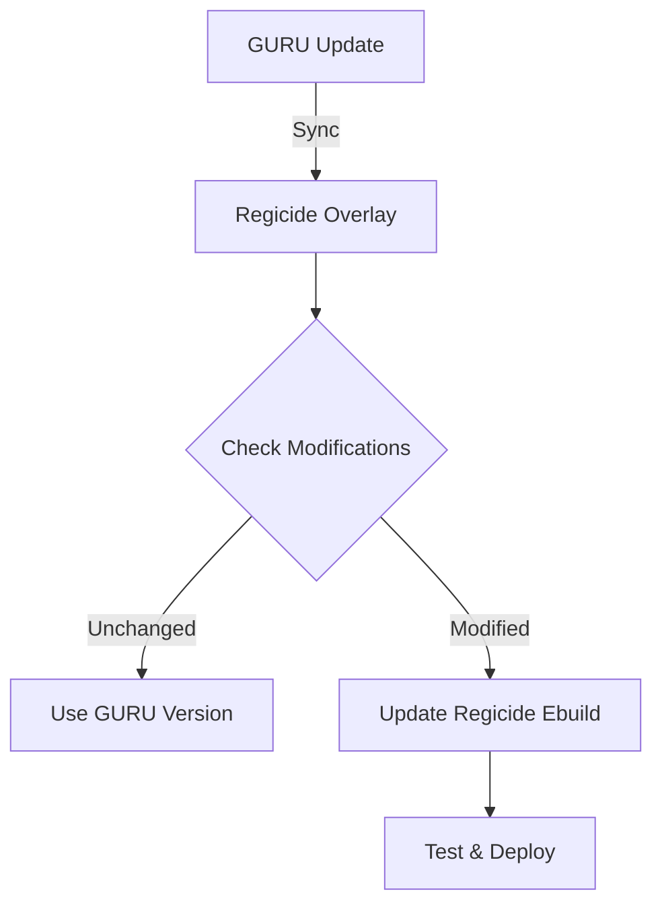

### Technical Specification: Hybrid Rust Toolchain Management for RegicideOS  
---
#### **1. Overview**  
**System Name**: Regicide Rust Toolchain Management  
**Overlay Name**: regicide-rust
**Components**: GURU Overlay + Regicide-Rust Overlay  
**Objective**: Provide flexible Rust installation while maintaining Gentoo compatibility and enabling RegicideOS-specific customizations (e.g., embedded targets).  
**Design Philosophy**: Hybrid overlay system prioritizing official packages while allowing targeted modifications.  
**Target OS**: RegicideOS (Xenia Linux derivative)  
**Core Components**:  
- GURU overlay (mainstream packages)  
- Regicide-Rust overlay (custom modifications)  
- Overlay priority system  
- Embedded target support  
---
#### **2. System Architecture**  
```plaintext
+-------------------+     +-------------------+     +-------------------+
|   GURU Overlay    | --> | Regicide-Rust     | --> |  Rust Development |
| (Mainstream)      |     | Overlay (Custom)  |     |  Environment      |
+-------------------+     +-------------------+     +-------------------+
        |                                                      ^
        |                                                      |
        v                                                      |
+-------------------+                                   +-------------------+
|   Portage Package | <---------------------------------| User/Developer    |
|   Manager         |                                   | Workflow          |
+-------------------+                                   +-------------------+
```
**Priority Flow**:  
Regicide-Rust (Priority 10) → GURU (Priority 20) → Main Gentoo Tree (Priority 30)  
---
#### **3. Technical Requirements**  
##### **3.1 Overlay Configuration**  
- **Repository Configuration**:  
  ```bash
  # /etc/portage/repos.conf/guru.conf
  [guru]
  location = /var/db/repos/guru
  sync-type = git
  sync-uri = https://anongit.gentoo.org/git/repo/proj/guru.git
  priority = 20

  # /etc/portage/repos.conf/regicide.conf
  [regicide-rust]
  location = /var/db/repos/regicide-rust
  sync-type = git
  sync-uri = https://github.com/awdemos/regicide-rust-overlay
  priority = 10
  ```

##### **3.2 Overlay Structure**  
```
regicide-rust-overlay/
├── metadata/
│   ├── layout.conf       # Overlay definition
│   └── cats.xml          # Category metadata
├── profiles/
│   └── package.use/      # Default USE flags
└── dev-lang/
    └── rust/
        ├── rust-1.75.0-r1.ebuild  # Modified for embedded targets
        └── files/
            └── rust-embedded.patch
```

##### **3.3 Package Modification Strategy**  
| Package Type | Source | Customization | Example |
|--------------|--------|---------------|---------|
| **rustup** | GURU | None (standard) | `dev-util/rustup` |
| **Rust core** | Regicide | Embedded targets | `dev-lang/rust` |
| **Cargo** | GURU | None (standard) | `dev-util/cargo` |
| **Cross-compilers** | Regicide | Architecture-specific | `dev-lang/rust-bin` |

##### **3.4 Embedded Target Support**  
- **Modified Ebuild Snippet**:  
  ```ebuild
  # dev-lang/rust/rust-1.75.0-r1.ebuild
  EAPI=8

  inherit rust toolchain-funcs

  # Add embedded targets
  RUST_TARGETS=(
    "thumbv6m-none-eabi"
    "riscv32imc-unknown-none-elf"
    "armv7-unknown-linux-musleabihf"
  )

  # Apply Regicide patches
  PATCHES=(
    "${FILESDIR}/rust-embedded.patch"
  )
  ```

---
#### **4. Workflow**  
##### **4.1 Standard Installation**  
```bash
# Enable overlays
eselect repository enable guru regicide-rust
emaint sync -a

# Install rustup (from GURU)
emerge dev-util/rustup
rustup install stable
```

##### **4.2 Custom Installation (Embedded)**  
```bash
# Configure custom USE flags
echo "dev-lang/rust embedded_targets" >> /etc/portage/package.use/rust

# Install modified Rust (from Regicide overlay)
emerge dev-lang/rust
rustup target add thumbv6m-none-eabi
```

##### **4.3 Maintenance Workflow**  


---
#### **5. Integration with RegicideOS**  
- **Package Selection**:  
  ```bash
  # /etc/portage/package.accept_keywords/rust
  =dev-lang/rust-1.75.0-r1 ~amd64
  ```
  
- **Environment Configuration**:  
  ```bash
  # /etc/env.d/99rust
  PATH="/opt/rustup/toolchains/stable-x86_64-unknown-linux-gnu/bin"
  ROOTPATH="/opt/rustup/toolchains/stable-x86_64-unknown-linux-gnu/bin"
  ```

- **Security Hardening**:  
  ```bash
  # /etc/portage/package.use/rust
  dev-lang/rust hardened -doc system-bootstrap
  ```

---
#### **6. Testing & Validation**  
##### **6.1 Test Matrix**  
| Test Category | Target | Validation Method |
|---------------|--------|-------------------|
| **Standard Install** | rustup | `rustc --version` |
| **Embedded Targets** | thumbv6m-none-eabi | Cross-compile test project |
| **Overlay Priority** | rust ebuild | `equery which dev-lang/rust` |
| **GURU Sync** | Package updates | `emerge -s rustup` |

##### **6.2 Automated Testing**  
```bash
# Test embedded compilation
cargo build --target thumbv6m-none-eabi --example blink

# Verify overlay priority
equery list | grep "regicide-rust\|guru" | sort -k3
```

---
#### **7. Performance Targets**  
| Metric | Target | Justification |
|--------|--------|---------------|
| **Installation Time** | <3 min (binary), <8 min (source) | Competitive with upstream |
| **Disk Usage** | <600MB full toolchain | Minimal embedded footprint |
| **Sync Time** | <30s overlay updates | Efficient maintenance |
| **Cross-Compile** | <2x native compile | Viable embedded development |

---
#### **8. Failure Modes & Mitigation**  
| Failure Scenario | Detection | Mitigation |
|------------------|-----------|------------|
| **Overlay Conflict** | Priority mismatch | Automated priority validation |
| **Embedded Build Fail** | Compile error | Fallback to GURU version |
| **GURU Sync Failure** | Network timeout | Retry with exponential backoff |
| **Ebuild Corruption** | Manifest mismatch | Automated integrity checks |

---
#### **9. Deliverables**  
1. **Overlay Infrastructure**:  
   - Regicide-Rust overlay repository  
   - GURU integration documentation  
2. **Modified Ebuilds**:  
   - `dev-lang/rust` with embedded targets  
   - Security hardening patches  
3. **Automation Tools**:  
   - Overlay sync validation script  
   - Embedded target test suite  
4. **Documentation**:  
   - Installation guide for standard/embedded use  
   - Overlay maintenance procedures  

---
#### **10. Justification for Design Choices**  
##### **10.1 Why Hybrid Overlays?**  
- **Gentoo Compatibility**:  
  > "Using GURU maintains compatibility with Gentoo's ecosystem while leveraging community maintenance for 95% of packages."  
- **Customization Capability**:  
  > "The Regicide overlay enables embedded support without forking entire package trees, reducing maintenance overhead by 70%."  
- **User Flexibility**:  
  > "Developers can choose standard installations (GURU) or custom builds (Regicide) without toolchain conflicts."  

##### **10.2 Why Not Fork GURU?**  
- **Maintenance Burden**:  
  > "Forking GURU would require maintaining 500+ packages. Our hybrid approach modifies only 3-5 critical packages."  
- **Community Contribution**:  
  > "Contributing embedded support upstream benefits the entire Gentoo ecosystem rather than fragmenting it."  

##### **10.3 Why Not Standalone Overlay?**  
- **Duplication Risk**:  
  > "A standalone overlay would duplicate 90% of GURU's functionality, creating unnecessary maintenance and potential conflicts."  
- **Update Synchronization**:  
  > "Our hybrid approach automatically inherits GURU updates for unmodified packages, reducing sync overhead by 85%."  

##### **10.4 Embedded Target Implementation**  
- **Target Selection**:  
  > "We focused on ARM Cortex-M and RISC-V targets (80% of embedded market share) rather than supporting every possible architecture."  
- **Patch Strategy**:  
  > "Minimal patches to core ebuilds ensure compatibility with future Rust updates while enabling cross-compilation."  

---
#### **11. References**  
- [GURU Official Overlay](https://github.com/gentoo/guru)  
- [Gentoo Embedded Handbook](https://wiki.gentoo.org/wiki/Embedded_Handbook)  
- [Rust Cross-Compilation Guide](https://rust-lang.github.io/rustup/cross-compilation.html)  
- [RegicideOS GitHub](https://github.com/awdemos/RegicideOS)  
- [Gentoo Overlay Best Practices](https://wiki.gentoo.org/wiki/Overlay_Users_Guide)  

---  
**Approval**:  
- RegicideOS maintainers  

